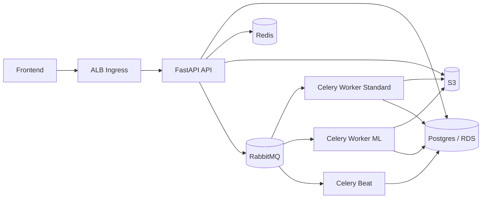

# PixTools: Distributed Image Processing Platform


PixTools is a production-grade, distributed asynchronous image-processing system. It is engineered to handle compute-heavy ML inference and standard image operations at scale, prioritizing high availability, operational resilience, and zero-trust deployment pipelines.

**[View Live Demo](http://k8s-pixtools-pixtools-f106dc8583-233935853.us-east-1.elb.amazonaws.com)** | **[Explore API Docs](http://k8s-pixtools-pixtools-f106dc8583-233935853.us-east-1.elb.amazonaws.com/docs)** | **[Check System Health](http://k8s-pixtools-pixtools-f106dc8583-233935853.us-east-1.elb.amazonaws.com/api/health)**

## Overview

Users upload an image from the frontend, choose one or more operations, and receive downloadable outputs when background processing completes.

Supported operations:
- `jpg`, `png`, `webp`, `avif` format conversion
- `denoise` (DnCNN)
- `metadata` (EXIF extraction)

Core behavior:
- async processing via RabbitMQ + Celery
- idempotent request handling (`Idempotency-Key` header)
- webhook callback with circuit-breaker protection
- ZIP bundle generation for processed outputs
- 24-hour retention model for S3 objects and job history

## Architecture



## Runtime Topology

| Component | Implementation | Rationale |
| :--- | :--- | :--- |
| **Ingress & API** | AWS ALB Controller -> K3s Pods -> FastAPI | Horizontally scalable edge routing with built-in health probing. |
| **Message Broker** | RabbitMQ (StatefulSet) | Durable, persistent queueing with Dead Letter Exchanges for failed tasks. |
| **State & Locking** | Redis & PostgreSQL 16 (AWS RDS) | Separated transient lock/idempotency state (Redis) from persistent job tracking (RDS). |
| **Infrastructure** | Terraform + AWS SSM | 100% declarative IaC. Secrets are never hardcoded; injected securely via Systems Manager Parameter Store. |
| **CI/CD** | GitHub Actions (OIDC) | Zero-trust deployment pipeline utilizing short-lived STS tokens (no long-lived IAM user keys). |

## System Design & Engineering Highlights

* **Asynchronous Orchestration:** Decoupled the FastAPI ingress from heavy compute tasks using RabbitMQ and Celery. Dedicated worker queues (`default_queue` vs. `ml_inference_queue`) prevent long-running ML jobs (like DnCNN denoising) from starving standard conversion tasks.
* **Idempotency & Fault Tolerance:** Implemented `Idempotency-Key` headers backed by Redis to guarantee safe retries across distributed network drops. 
* **Resilient Webhook Callbacks:** Integrated `pybreaker` circuit breakers to protect the worker nodes from cascading failures when client webhook endpoints are unreachable or slow.
* **Cloud-Native Observability:** Instrumented with OpenTelemetry, shipping logs, metrics, and traces to a Grafana Cloud LGTM stack via a lightweight Alloy DaemonSet, ensuring complete visibility without burdening the K3s node.
* **Cost-Optimized Compute:** Deployed on an AWS Auto Scaling Group utilizing highly ephemeral `m7i-flex.large` Spot Instances, achieving production-like architecture at a fraction of on-demand costs.

## API Contract

Base path: `/api`

### `POST /api/process`

`multipart/form-data` request:
- `file` (required)
- `operations` (required, JSON string array, example `["webp","metadata"]`)
- `operation_params` (optional JSON string object keyed by operation)
  - Options supported: 
    - `quality` (1-100) for `jpg` and `webp`
    - `resize` (`width` and/or `height` in px) for conversion operations
- `webhook_url` (optional)

Header:
- `Idempotency-Key` (optional but recommended)

Example:

```bash
curl -X POST "http://localhost:8000/api/process" \
  -H "Idempotency-Key: demo-001" \
  -F "file=@test_image.png;type=image/png" \
  -F "operations=[\"webp\",\"denoise\",\"metadata\"]" \
  -F "operation_params={\"webp\":{\"quality\":80},\"denoise\":{\"resize\":{\"width\":1280}}}" \
  -F "webhook_url=https://webhook.site/<id>"
```

### `GET /api/jobs/{job_id}`

Returns current state and outputs:
- `status`
- `operations`
- `result_urls`
- `archive_url`
- `metadata`
- `error_message`
- `created_at`

### `GET /api/health`

Dependency health probe used for readiness/liveness.

## Local Development

### Prerequisites

- Docker + Docker Compose

### Start stack

```bash
cp .env.example .env
docker compose up -d --build
```

Services started locally:
- `api`
- `worker-standard`
- `worker-ml`
- `beat`
- `postgres`
- `redis`
- `rabbitmq`
- `localstack`
- `migrate` (one-shot Alembic upgrade)

### Local endpoints

- App: `http://localhost:8000`
- Docs: `http://localhost:8000/docs`
- RabbitMQ UI: `http://localhost:15672`

### Common commands

```bash
docker compose ps
docker compose logs -f api
docker compose logs -f worker-standard
docker compose run --rm migrate
```

## Infrastructure & Operations (GitOps)

Deployments are automated through a single reconcile flow executed over AWS Systems Manager (SSM), so cluster fixes are versioned instead of manual patches.
Infrastructure code lives in `infra/`.  
Rendered manifests are generated from `k8s/` by `scripts/deploy/render-manifests.sh`.

### Canonical deploy flow

1. CI/CD builds API and worker images and pushes immutable digests to ECR.
2. `scripts/deploy/render-manifests.sh` renders `k8s/` templates and packages `scripts/deploy/reconcile-cluster.sh`.
3. CD uploads artifacts to `s3://<manifest-bucket>/<manifest-prefix>`.
4. CD runs one remote command via `scripts/deploy/run-on-ssm.sh` that executes `reconcile-cluster.sh` on the K3s node.
5. `reconcile-cluster.sh` performs the full convergence pass:
   - sync manifests from S3
   - refresh ECR pull secret
   - materialize runtime secrets/config from SSM
   - clean stale Kubernetes nodes and relabel node roles (`pixtools-workload-app`, `pixtools-workload-infra`)
   - apply manifests in deterministic order
   - auto-recover RabbitMQ PVC node-affinity mismatch when detected
   - wait for rollout completion of core workloads

### Terraform baseline

```bash
cd infra
terraform init -backend-config=backend.hcl
terraform plan -var-file=dev.tfvars
terraform apply -var-file=dev.tfvars
```

Important outputs:
- `manifests_bucket_name`
- `alb_security_group_id`
- `ecr_api_repository_url`
- `ecr_worker_repository_url`
- `grafana_cloud_stack_id_parameter`
- `grafana_cloud_logs_user_parameter`
- `grafana_cloud_metrics_user_parameter`
- `grafana_cloud_traces_user_parameter`
- `grafana_cloud_api_key_parameter`
- `grafana_cloud_logs_url_parameter`
- `grafana_cloud_metrics_url_parameter`
- `grafana_cloud_traces_url_parameter`

### Monitoring access

Grafana UI is hosted in Grafana Cloud (not on the K3s node).  
The cluster runs only a lightweight Alloy collector.

Grafana Cloud ingest settings are stored in SSM Parameter Store:

```bash
aws ssm get-parameter \
  --name "/pixtools/dev/grafana_cloud_stack_id" \
  --query "Parameter.Value" \
  --output text

aws ssm get-parameter \
  --name "/pixtools/dev/grafana_cloud_api_key" \
  --with-decryption \
  --query "Parameter.Value" \
  --output text
```

Optional per-signal username overrides:
- `/pixtools/dev/grafana_cloud_logs_user`
- `/pixtools/dev/grafana_cloud_metrics_user`
- `/pixtools/dev/grafana_cloud_traces_user`

If unset, deploy logic falls back to `/pixtools/dev/grafana_cloud_stack_id`.

### GitHub Actions pipelines

- `CI` (`.github/workflows/ci.yaml`)
  - `ruff`
  - `mypy`
  - `pytest`
  - Docker image build + Trivy scan
  - `pip-audit` + `bandit` + Trivy FS scan

- `CD-Dev` (`.github/workflows/cd-dev.yaml`)
  - trigger: push to `main`
  - build + push API/worker images to ECR
  - render manifests with image digests + ingress values
  - sync manifests to S3
  - execute `scripts/deploy/reconcile-cluster.sh` on K3s node via SSM
  - run post-deploy smoke test (`/api/health`, then `POST /api/process`, then poll to completion)

- `CD-Prod` (`.github/workflows/cd-prod.yaml`)
  - manual trigger (`workflow_dispatch`)
  - same reconcile flow as `CD-Dev` against `prod` secrets/prefix

### Required GitHub secrets

Set in the `dev` environment:
- `AWS_DEPLOY_ROLE_ARN`
- `MANIFEST_BUCKET`
- `ALB_SECURITY_GROUP_ID`
- `ALLOWED_INGRESS_CIDRS`

For public demo access:
- `ALLOWED_INGRESS_CIDRS=0.0.0.0/0`

For `prod`, use the same secret names in the `prod` environment.

### OIDC trust setup (required once)

Create an IAM role trusted by GitHub OIDC and use its ARN as `AWS_DEPLOY_ROLE_ARN`.
At minimum, the role trust policy must allow:
- provider: `token.actions.githubusercontent.com`
- audience: `sts.amazonaws.com`
- subject scoped to your repo/branch or environment (recommended)

### Deployment rollback

Two practical rollback paths:
1. Re-run a previous successful CD workflow run (previous commit state).
2. Redeploy previous image digest by updating rendered manifest image references and re-applying.

### Full teardown (destroy demo environment)

Use the PowerShell teardown script for a complete cleanup pass:
- scales K3s ASG to zero
- removes in-cluster workloads via SSM
- deletes AWS Load Balancer Controller artifacts (ALB/target groups/security groups)
- purges ECR images and versioned S3 buckets
- runs `terraform destroy` (with retry cleanup)
- removes SSM runtime parameters

```powershell
powershell -ExecutionPolicy Bypass -File .\scripts\teardown\teardown-aws.ps1 -Environment dev
```

Non-interactive destroy:

```powershell
powershell -ExecutionPolicy Bypass -File .\scripts\teardown\teardown-aws.ps1 -Environment dev -AutoApprove
```

Optional flags:
- By default teardown resets the external K3s datastore DB (`k3s_state`) via SSM before destroying infra to avoid stale control-plane state on next deploy.
- `-SkipK3sDatastoreReset` to disable that DB reset.
- `-DestroyBackend` to also remove Terraform backend S3 state bucket and lock table.
- `-DeleteGithubDeployRole` to delete the GitHub deploy IAM role (`GitHubActionsPixToolsDeployRole` by default).

## Security Notes

- Runtime secrets are sourced from SSM and injected into Kubernetes secrets/config at bootstrap.
- ALB ingress CIDR is configurable (`ALLOWED_INGRESS_CIDRS`).
- OpenAPI docs are intentionally public for portfolio/demo exploration.
- `API_KEY` is provisioned and available in config, but route-level enforcement is intentionally not enabled in current demo flow.

## Repository Structure

```text
app/
  routers/         FastAPI endpoints
  services/        S3, idempotency, webhook, DAG builder
  tasks/           Celery workers (image, metadata, archive, finalize, maintenance, ML)
  static/          Frontend (HTML/CSS/JS)
  ml/              DnCNN definition
alembic/           Schema migrations
infra/             Terraform IaC
k8s/               Kubernetes manifests templates
scripts/deploy/    Manifest rendering and SSM deploy helpers
scripts/teardown/  Full environment teardown helpers
bench/             k6 benchmark scenarios and measurement playbook
tests/             Unit/integration tests
```

## Troubleshooting

### Frontend stuck on upload

- Check browser console for JS errors.
- Verify network call to `POST /api/process`.
- Confirm backend health:
  ```bash
  curl http://<host>/api/health
  ```

### Job stuck in `PENDING`

- Verify RabbitMQ and workers are up.
- Check worker logs for task failures.
- Confirm migrations are applied (`alembic upgrade head`).

### Monitoring pods not ready

- Check monitoring workloads:
  ```bash
  kubectl -n pixtools get pods | grep alloy
  ```
- Check Alloy health:
  ```bash
  kubectl -n pixtools port-forward deploy/alloy 12345:12345
  curl http://localhost:12345/-/ready
  ```

### Local reset

```bash
docker compose down -v
docker compose up -d --build
docker compose logs -f migrate
```

## About This Project

PixTools was built from scratch to demonstrate full-lifecycle cloud engineering capabilities. Rather than relying on managed PaaS providers (like Heroku or Vercel), I chose to architect the underlying VPC, subnets, Kubernetes cluster, and CI/CD pipelines directly in AWS using Terraform. This project serves as a practical demonstration of handling distributed system complexities, secure IAM federation, and advanced observability. 

## License

Internal/portfolio project.
