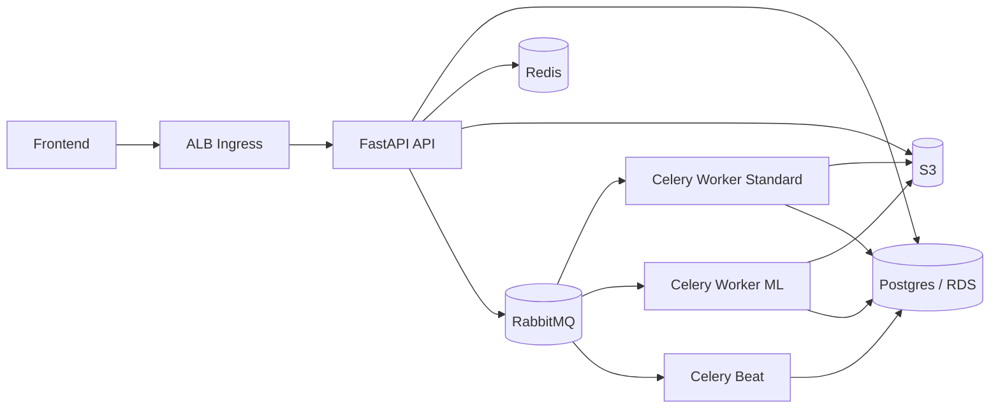

# PixTools

PixTools is a distributed image-processing system built with FastAPI + Celery.  
It is designed as a resume-grade project that demonstrates async task orchestration, operational resilience, and cloud deployment discipline.

## Overview

Users upload an image from the frontend, choose one or more operations, and receive downloadable outputs when background processing completes.

Supported operations:
- `jpg`, `png`, `webp`, `avif` format conversion
- `denoise` (DnCNN)
- `metadata` (EXIF extraction)

Core behavior:
- async processing via RabbitMQ + Celery
- idempotent request handling (`Idempotency-Key` header)
- webhook callback with circuit-breaker protection
- ZIP bundle generation for processed outputs
- 24-hour retention model for S3 objects and job history

## Live Demo

- App: `http://k8s-pixtools-pixtools-f106dc8583-233935853.us-east-1.elb.amazonaws.com`
- API docs: `http://k8s-pixtools-pixtools-f106dc8583-233935853.us-east-1.elb.amazonaws.com/docs`
- Health check: `http://k8s-pixtools-pixtools-f106dc8583-233935853.us-east-1.elb.amazonaws.com/api/health`

## Architecture



## Runtime Topology

| Layer | Stack | Hosting |
|---|---|---|
| API | FastAPI + Uvicorn | K3s pod |
| Task Queue | Celery 5 + RabbitMQ | K3s pods |
| Idempotency/Backend | Redis | K3s pod |
| Stateful DB | PostgreSQL 16 | AWS RDS `db.t4g.micro` (single AZ) |
| Object Storage | S3 | AWS managed |
| Compute | K3s on EC2 Spot | ASG with `m7i-flex.large` primary |
| Ingress | AWS Load Balancer Controller | ALB (internet-facing) |
| Config/Secrets | SSM Parameter Store -> K8s Secret/ConfigMap | AWS + bootstrap |
| Images | ECR (`pixtools-api`, `pixtools-worker`) | AWS managed |

## Key Features

- Celery queue routing:
  - `default_queue`: conversions, metadata, archive, finalize, maintenance
  - `ml_inference_queue`: denoise
- Dead-letter exchange configuration for failed messages.
- Deep health checks on `GET /api/health`:
  - database
  - redis
  - rabbitmq
  - s3
- Job pruning:
  - hourly Celery Beat task (`app.tasks.maintenance.prune_expired_jobs`)
- Webhook resilience:
  - `pybreaker` circuit breaker (`WEBHOOK_CB_FAIL_THRESHOLD`, `WEBHOOK_CB_RESET_TIMEOUT`)
- Frontend processing safeguards:
  - request timeout handling
  - robust idempotency key generation even when `crypto.randomUUID()` is unavailable
- Monitoring and alerting:
  - CloudWatch alarms for ALB 5XX, ASG in-service count, and RDS CPU/free storage
  - SNS topic for alarm fan-out (optional email subscription)
  - Lightweight Alloy collector shipping logs/metrics/traces to Grafana Cloud

## API Contract

Base path: `/api`

### `POST /api/process`

`multipart/form-data` request:
- `file` (required)
- `operations` (required, JSON string array, example `["webp","metadata"]`)
- `operation_params` (optional JSON string object keyed by operation)
- `webhook_url` (optional)

Header:
- `Idempotency-Key` (optional but recommended)

Example:

```bash
curl -X POST "http://localhost:8000/api/process" \
  -H "Idempotency-Key: demo-001" \
  -F "file=@test_image.png;type=image/png" \
  -F "operations=[\"webp\",\"denoise\",\"metadata\"]" \
  -F "operation_params={\"webp\":{\"quality\":80},\"denoise\":{\"resize\":{\"width\":1280}}}" \
  -F "webhook_url=https://webhook.site/<id>"
```

### `GET /api/jobs/{job_id}`

Returns current state and outputs:
- `status`
- `operations`
- `result_urls`
- `archive_url`
- `metadata`
- `error_message`
- `created_at`

### `GET /api/health`

Dependency health probe used for readiness/liveness.

## Local Development

### Prerequisites

- Docker + Docker Compose

### Start stack

```bash
cp .env.example .env
docker compose up -d --build
```

Services started locally:
- `api`
- `worker-standard`
- `worker-ml`
- `beat`
- `postgres`
- `redis`
- `rabbitmq`
- `localstack`
- `migrate` (one-shot Alembic upgrade)

### Local endpoints

- App: `http://localhost:8000`
- Docs: `http://localhost:8000/docs`
- RabbitMQ UI: `http://localhost:15672`

### Common commands

```bash
docker compose ps
docker compose logs -f api
docker compose logs -f worker-standard
docker compose run --rm migrate
```

## Cloud Deployment (AWS, `us-east-1`)

Infrastructure code lives in `infra/`.  
Rendered manifests are generated from `k8s/` by `scripts/deploy/render-manifests.sh`.

### Terraform baseline

```bash
cd infra
terraform init -backend-config=backend.hcl
terraform plan -var-file=dev.tfvars
terraform apply -var-file=dev.tfvars
```

Important outputs:
- `manifests_bucket_name`
- `alb_security_group_id`
- `ecr_api_repository_url`
- `ecr_worker_repository_url`
- `grafana_cloud_stack_id_parameter`
- `grafana_cloud_logs_user_parameter`
- `grafana_cloud_metrics_user_parameter`
- `grafana_cloud_traces_user_parameter`
- `grafana_cloud_api_key_parameter`
- `grafana_cloud_logs_url_parameter`
- `grafana_cloud_metrics_url_parameter`
- `grafana_cloud_traces_url_parameter`

### Monitoring access

Grafana UI is hosted in Grafana Cloud (not on the K3s node).  
The cluster runs only a lightweight Alloy collector.

Grafana Cloud ingest settings are stored in SSM Parameter Store:

```bash
aws ssm get-parameter \
  --name "/pixtools/dev/grafana_cloud_stack_id" \
  --query "Parameter.Value" \
  --output text

aws ssm get-parameter \
  --name "/pixtools/dev/grafana_cloud_api_key" \
  --with-decryption \
  --query "Parameter.Value" \
  --output text
```

Optional per-signal username overrides:
- `/pixtools/dev/grafana_cloud_logs_user`
- `/pixtools/dev/grafana_cloud_metrics_user`
- `/pixtools/dev/grafana_cloud_traces_user`

If unset, deploy logic falls back to `/pixtools/dev/grafana_cloud_stack_id`.

### GitHub Actions pipelines

- `CI` (`.github/workflows/ci.yaml`)
  - `ruff`
  - `mypy`
  - `pytest`
  - Docker image build + Trivy scan
  - `pip-audit` + `bandit` + Trivy FS scan

- `CD-Dev` (`.github/workflows/cd-dev.yaml`)
  - trigger: push to `main`
  - build + push API/worker images to ECR
  - render manifests with image digests + ingress values
  - sync manifests to S3
  - apply manifests on K3s node via SSM command
  - run post-deploy smoke test (`/api/health`, then `POST /api/process`, then poll to completion)

- `CD-Prod` (`.github/workflows/cd-prod.yaml`)
  - manual trigger (`workflow_dispatch`)

### Required GitHub secrets

Set in the `dev` environment:
- `AWS_DEPLOY_ROLE_ARN`
- `MANIFEST_BUCKET`
- `ALB_SECURITY_GROUP_ID`
- `ALLOWED_INGRESS_CIDRS`

For public demo access:
- `ALLOWED_INGRESS_CIDRS=0.0.0.0/0`

For `prod`, use the same secret names in the `prod` environment.

### OIDC trust setup (required once)

Create an IAM role trusted by GitHub OIDC and use its ARN as `AWS_DEPLOY_ROLE_ARN`.
At minimum, the role trust policy must allow:
- provider: `token.actions.githubusercontent.com`
- audience: `sts.amazonaws.com`
- subject scoped to your repo/branch or environment (recommended)

### Deployment rollback

Two practical rollback paths:
1. Re-run a previous successful CD workflow run (previous commit state).
2. Redeploy previous image digest by updating rendered manifest image references and re-applying.

## Security Notes

- Runtime secrets are sourced from SSM and injected into Kubernetes secrets/config at bootstrap.
- ALB ingress CIDR is configurable (`ALLOWED_INGRESS_CIDRS`).
- OpenAPI docs are intentionally public for portfolio/demo exploration.
- `API_KEY` is provisioned and available in config, but route-level enforcement is intentionally not enabled in current demo flow.

## Repository Structure

```text
app/
  routers/         FastAPI endpoints
  services/        S3, idempotency, webhook, DAG builder
  tasks/           Celery workers (image, metadata, archive, finalize, maintenance, ML)
  static/          Frontend (HTML/CSS/JS)
  ml/              DnCNN definition
alembic/           Schema migrations
infra/             Terraform IaC
k8s/               Kubernetes manifests templates
scripts/deploy/    Manifest rendering and SSM deploy helpers
tests/             Unit/integration tests
```

## Troubleshooting

### Frontend stuck on upload

- Check browser console for JS errors.
- Verify network call to `POST /api/process`.
- Confirm backend health:
  ```bash
  curl http://<host>/api/health
  ```

### Job stuck in `PENDING`

- Verify RabbitMQ and workers are up.
- Check worker logs for task failures.
- Confirm migrations are applied (`alembic upgrade head`).

### Monitoring pods not ready

- Check monitoring workloads:
  ```bash
  kubectl -n pixtools get pods | grep alloy
  ```
- Check Alloy health:
  ```bash
  kubectl -n pixtools port-forward deploy/alloy 12345:12345
  curl http://localhost:12345/-/ready
  ```

### Local reset

```bash
docker compose down -v
docker compose up -d --build
docker compose logs -f migrate
```

## License

Internal/portfolio project.
