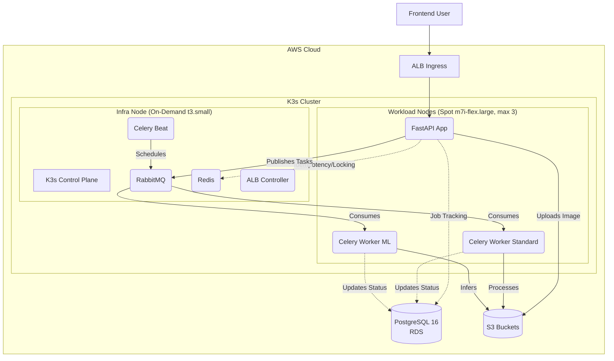

# PixTools: Distributed Image Processing Platform


<br/>
<p align="center">
  
</p>
<br/>

PixTools is a production-grade, distributed asynchronous image-processing system. It is engineered to handle compute-heavy ML inference and standard image operations at scale, prioritizing high availability, operational resilience, and zero-trust deployment pipelines.

**[View Live Demo](http://k8s-pixtools-pixtools-f106dc8583-233935853.us-east-1.elb.amazonaws.com)** | **[Explore API Docs](http://k8s-pixtools-pixtools-f106dc8583-233935853.us-east-1.elb.amazonaws.com/docs)** | **[Check System Health](http://k8s-pixtools-pixtools-f106dc8583-233935853.us-east-1.elb.amazonaws.com/api/health)**

## Overview

Users upload an image from the frontend, choose one or more operations, and receive downloadable outputs when background processing completes.

Supported operations:
- `jpg`, `png`, `webp`, `avif` format conversion
- `denoise` (DnCNN)
- `metadata` (EXIF extraction)

Core behavior:
- async processing via RabbitMQ + Celery
- idempotent request handling (`Idempotency-Key` header)
- webhook callback with circuit-breaker protection
- ZIP bundle generation for processed outputs
- 24-hour retention model for S3 objects and job history

## Architecture



## Runtime Topology

| Component | Implementation | Rationale |
| :--- | :--- | :--- |
| **Ingress & API** | AWS ALB Controller -> K3s Pods -> FastAPI | Horizontally scalable edge routing with built-in health probing. |
| **Message Broker** | RabbitMQ (StatefulSet) | Durable, persistent queueing with Dead Letter Exchanges for failed tasks. |
| **State & Locking** | Redis & PostgreSQL 16 (AWS RDS) | Separated transient lock/idempotency state (Redis) from persistent job tracking (RDS). |
| **Control Plane** | **K3s Server on On-Demand EC2** | Ensures cluster stability. Stateful tracking, locking, and control-plane metrics are isolated from the chaos of Spot terminations. |
| **Data Plane** | **K3s Agents on Spot Fleet** | Scalable `m7i-flex.large` spot instances handle the heavy Celery and API lifting at 70% discount. |
| **Infrastructure** | Terraform + AWS SSM | 100% declarative IaC. Secrets are never hardcoded; injected securely via Systems Manager Parameter Store. |
| **CI/CD** | GitHub Actions (OIDC) | Zero-trust deployment pipeline utilizing short-lived STS tokens for AWS authentication. |

## The Scale-Up Struggle & Engineering Highlights

### The "Ghost Node" Blackout
The original architecture relied on a single unified K3s Auto Scaling Group backed by Spot Instances. When AWS inevitably reclaimed the spot instance during heavy ML load, it took down the control plane, RabbitMQ, and the API simultaneously. Deployments would hang forever trying to resolve "Ghost Nodes" that AWS had killed but Kubernetes still thought were `NotReady`. 
**The Fix:** A massive dual-node re-architecture. The control plane, RabbitMQ, and Redis were moved to a stable, on-demand `infra` node. The heavy-lifting API and Celery workers were moved to a scalable array of Spot `workload` nodes. If AWS kills a spot instance now, Celery gracefully requeues the task, the control plane stays alive, and the user never notices.

### Dynamic Infrastructure as Code
Early iterations of the CI/CD pipeline relied on hardcoded GitHub Secrets for things like the AWS Load Balancer Security Group ID. When Terraform naturally destroyed and recreated these resources during the dual-node architecture shift, the pipeline broke natively trying to attach ALBs to ghost security groups.
**The Fix:** Fully dynamic state resolution. Terraform now provisions and writes the exact `alb_security_group_id` directly to AWS Systems Manager (SSM) Parameter Store. The GitHub Actions CD pipeline queries SSM at runtime, completely eliminating out-of-sync credential drift.

### The Kubelet Proxy 502 Mystery
After the dual-node split, `kubectl logs` and Grafana Alloy's log tailing started returning `502 Bad Gateway` for every pod on the workload nodes. The K3s API server was proxying to the agent's kubelet on port `10250`, but the underlying TCP connection was being silently dropped by AWS.
**Root Cause:** On AWS EC2, nodes in different subnets can route to each other via their *public* IPs — even within the same VPC. When traffic hairpins through the public internet, it no longer matches VPC CIDR-based security group rules. The packets arrive from a public IP that the security group doesn't recognize.
**The Fix:** Switched the K3s node security group from a CIDR-based ingress rule to a **self-referencing** security group rule (`self = true`). This tells AWS "any resource attached to *this* security group can talk to any other resource attached to *this* security group" — regardless of which IP address the traffic arrives from.

### The Celery Metrics Flatline
Grafana dashboards showed `pixtools_job_end_to_end_seconds_sum` stuck permanently at `0`, even while jobs were visibly completing. The API pod's `/metrics` endpoint was being scraped perfectly by Alloy, so why was everything zero?
**Root Cause:** The FastAPI app and Celery workers share the same codebase. When the API boots, it imports the task files and *registers* the Prometheus metric in its own memory. Alloy scrapes it, sees it exists, and reports it — but the API only *queues* jobs, it doesn't *execute* them. The actual work happens inside the Celery worker processes, which have no embedded HTTP server and no `/metrics` endpoint.
**The Fix:** Deployed a dedicated [`celery-exporter`](https://github.com/danihodovic/celery-exporter) container that connects directly to the RabbitMQ broker and translates queue depths, task completions, and execution times into Prometheus metrics. Added a matching Alloy scrape job, and injected `CELERY_WORKER_SEND_TASK_EVENTS=True` into the worker ConfigMap so workers actually emit the events the exporter listens for.

### The 2-Minute Warning (Spot Resilience)
The original spot instance handler was a hand-rolled bash script running as a `systemd` service inside the EC2 user data. It polled the IMDS metadata endpoint every 5 seconds, and when it detected a termination notice, it attempted to download `kubectl` from the internet and run a best-effort `kubectl drain`. On a dying node with degraded networking, this frequently failed silently.
**The Fix:** Replaced the entire custom handler with the official [AWS Node Termination Handler (NTH)](https://github.com/aws/aws-node-termination-handler) deployed as a Kubernetes DaemonSet. NTH runs *inside* the cluster with proper RBAC, listens to IMDS natively via `hostNetwork: true`, and on a spot interruption notice: cordons the node, taints it to prevent new scheduling, gracefully evicts all pods, and lets Kubernetes reschedule them — all within the 2-minute warning window.

### The Ghost Label Problem
New spot agent nodes would join the K3s cluster successfully, but pods requiring `nodeSelector: pixtools-workload-app=true` would stay stuck in `Pending` indefinitely. The `reconcile-cluster.sh` script *did* label nodes by querying EC2 tags, but it only ran during initial deployment — not when a fresh spot instance replaced a terminated one mid-day.
**The Fix:** Baked the label directly into the K3s agent install command using `--node-label=pixtools-workload-app=true` in the EC2 user data template. Now every agent node is instantly schedulable the moment it joins the cluster, with zero reliance on external labeling scripts.

### Additional Highlights:
* **Asynchronous Orchestration:** Decoupled the FastAPI ingress from heavy compute tasks using RabbitMQ and Celery. Dedicated worker queues (`default_queue` vs. `ml_inference_queue`) prevent long-running ML jobs from starving standard conversion tasks.
* **Idempotency & Fault Tolerance:** Implemented `Idempotency-Key` headers backed by Redis to guarantee safe retries across distributed network drops. 
* **Resilient Webhook Callbacks:** Integrated `pybreaker` circuit breakers to protect the worker nodes from cascading failures when client webhook endpoints are unreachable or slow.
* **Cloud-Native Observability:** Instrumented with OpenTelemetry, shipping logs, metrics, and traces to a Grafana Cloud LGTM stack via a lightweight Alloy DaemonSet.

## API Contract

Base path: `/api`

### `POST /api/process`

`multipart/form-data` request:
- `file` (required)
- `operations` (required, JSON string array, example `["webp","metadata"]`)
- `operation_params` (optional JSON string object keyed by operation)
  - Options supported: 
    - `quality` (1-100) for `jpg` and `webp`
    - `resize` (`width` and/or `height` in px) for conversion operations
- `webhook_url` (optional)

Header:
- `Idempotency-Key` (optional but recommended)

Example:

```bash
curl -X POST "http://localhost:8000/api/process" \
  -H "Idempotency-Key: demo-001" \
  -F "file=@test_image.png;type=image/png" \
  -F "operations=[\"webp\",\"denoise\",\"metadata\"]" \
  -F "operation_params={\"webp\":{\"quality\":80},\"denoise\":{\"resize\":{\"width\":1280}}}" \
  -F "webhook_url=https://webhook.site/<id>"
```

### `GET /api/jobs/{job_id}`

Returns current state and outputs:
- `status`
- `operations`
- `result_urls`
- `archive_url`
- `metadata`
- `error_message`
- `created_at`

### `GET /api/health`

Dependency health probe used for readiness/liveness.

## Local Development

### Prerequisites

- Docker + Docker Compose

### Start stack

```bash
cp .env.example .env
docker compose up -d --build
```

Services started locally:
- `api`
- `worker-standard`
- `worker-ml`
- `beat`
- `postgres`
- `redis`
- `rabbitmq`
- `localstack`
- `migrate` (one-shot Alembic upgrade)

### Local endpoints

- App: `http://localhost:8000`
- Docs: `http://localhost:8000/docs`
- RabbitMQ UI: `http://localhost:15672`

### Common commands

```bash
docker compose ps
docker compose logs -f api
docker compose logs -f worker-standard
docker compose run --rm migrate
```

## Infrastructure & Operations (GitOps)

Deployments are automated through a single reconcile flow executed over AWS Systems Manager (SSM), so cluster fixes are versioned instead of manual patches.
Infrastructure code lives in `infra/`.  
Rendered manifests are generated from `k8s/` by `scripts/deploy/render-manifests.sh`.

### Canonical deploy flow

1. CI/CD builds API and worker images and pushes immutable digests to ECR.
2. `scripts/deploy/render-manifests.sh` renders `k8s/` templates and packages `scripts/deploy/reconcile-cluster.sh`.
3. CD uploads artifacts to `s3://<manifest-bucket>/<manifest-prefix>`.
4. CD runs one remote command via `scripts/deploy/run-on-ssm.sh` that executes `reconcile-cluster.sh` on the K3s node.
5. `reconcile-cluster.sh` performs the full convergence pass:
   - sync manifests from S3
   - refresh ECR pull secret
   - materialize runtime secrets/config from SSM
   - clean stale Kubernetes nodes and relabel node roles (`pixtools-workload-app`, `pixtools-workload-infra`)
   - apply manifests in deterministic order
   - auto-recover RabbitMQ PVC node-affinity mismatch when detected
   - wait for rollout completion of core workloads

### Terraform baseline

```bash
cd infra
terraform init -backend-config=backend.hcl
terraform plan -var-file=dev.tfvars
terraform apply -var-file=dev.tfvars
```

Important outputs:
- `manifests_bucket_name`
- `alb_security_group_id`
- `ecr_api_repository_url`
- `ecr_worker_repository_url`
- `grafana_cloud_stack_id_parameter`
- `grafana_cloud_logs_user_parameter`
- `grafana_cloud_metrics_user_parameter`
- `grafana_cloud_traces_user_parameter`
- `grafana_cloud_api_key_parameter`
- `grafana_cloud_logs_url_parameter`
- `grafana_cloud_metrics_url_parameter`
- `grafana_cloud_traces_url_parameter`

### Monitoring access

Grafana UI is hosted in Grafana Cloud (not on the K3s node).  
The cluster runs only a lightweight Alloy collector.

Grafana Cloud ingest settings are stored in SSM Parameter Store:

```bash
aws ssm get-parameter \
  --name "/pixtools/dev/grafana_cloud_stack_id" \
  --query "Parameter.Value" \
  --output text

aws ssm get-parameter \
  --name "/pixtools/dev/grafana_cloud_api_key" \
  --with-decryption \
  --query "Parameter.Value" \
  --output text
```

Optional per-signal username overrides:
- `/pixtools/dev/grafana_cloud_logs_user`
- `/pixtools/dev/grafana_cloud_metrics_user`
- `/pixtools/dev/grafana_cloud_traces_user`

If unset, deploy logic falls back to `/pixtools/dev/grafana_cloud_stack_id`.

### GitHub Actions pipelines

- `CI` (`.github/workflows/ci.yaml`)
  - `ruff`
  - `mypy`
  - `pytest`
  - Docker image build + Trivy scan
  - `pip-audit` + `bandit` + Trivy FS scan

- `CD-Dev` (`.github/workflows/cd-dev.yaml`)
  - trigger: push to `main`
  - build + push API/worker images to ECR
  - render manifests with image digests + ingress values
  - sync manifests to S3
  - execute `scripts/deploy/reconcile-cluster.sh` on K3s node via SSM
  - run post-deploy smoke test (`/api/health`, then `POST /api/process`, then poll to completion)

- `CD-Prod` (`.github/workflows/cd-prod.yaml`)
  - manual trigger (`workflow_dispatch`)
  - same reconcile flow as `CD-Dev` against `prod` secrets/prefix

### Required GitHub secrets

Set in the `dev` environment:
- `AWS_DEPLOY_ROLE_ARN`
- `MANIFEST_BUCKET`
- `ALLOWED_INGRESS_CIDRS`

*(Note: `ALB_SECURITY_GROUP_ID` is no longer a secret; it is fetched dynamically from SSM at runtime to prevent Terraform drift!)*

For public demo access:
- `ALLOWED_INGRESS_CIDRS=0.0.0.0/0`

For `prod`, use the same secret names in the `prod` environment.

### OIDC trust setup (required once)

Create an IAM role trusted by GitHub OIDC and use its ARN as `AWS_DEPLOY_ROLE_ARN`.
At minimum, the role trust policy must allow:
- provider: `token.actions.githubusercontent.com`
- audience: `sts.amazonaws.com`
- subject scoped to your repo/branch or environment (recommended)

### Deployment rollback

Two practical rollback paths:
1. Re-run a previous successful CD workflow run (previous commit state).
2. Redeploy previous image digest by updating rendered manifest image references and re-applying.

### Full teardown (destroy demo environment)

Use the PowerShell teardown script for a complete cleanup pass:
- scales K3s ASG to zero
- removes in-cluster workloads via SSM
- deletes AWS Load Balancer Controller artifacts (ALB/target groups/security groups)
- purges ECR images and versioned S3 buckets
- runs `terraform destroy` (with retry cleanup)
- removes SSM runtime parameters

```powershell
powershell -ExecutionPolicy Bypass -File .\scripts\teardown\teardown-aws.ps1 -Environment dev
```

Non-interactive destroy:

```powershell
powershell -ExecutionPolicy Bypass -File .\scripts\teardown\teardown-aws.ps1 -Environment dev -AutoApprove
```

Optional flags:
- By default teardown resets the external K3s datastore DB (`k3s_state`) via SSM before destroying infra to avoid stale control-plane state on next deploy.
- `-SkipK3sDatastoreReset` to disable that DB reset.
- `-DestroyBackend` to also remove Terraform backend S3 state bucket and lock table.

## Security Notes

- Runtime secrets are sourced from SSM and injected into Kubernetes secrets/config at bootstrap.
- ALB ingress CIDR is configurable (`ALLOWED_INGRESS_CIDRS`).
- OpenAPI docs are intentionally public for portfolio/demo exploration.
- `API_KEY` is provisioned and available in config, but route-level enforcement is intentionally not enabled in current demo flow.

## Repository Structure

```text
app/
  routers/         FastAPI endpoints
  services/        S3, idempotency, webhook, DAG builder
  tasks/           Celery workers (image, metadata, archive, finalize, maintenance, ML)
  static/          Frontend (HTML/CSS/JS)
  ml/              DnCNN definition
alembic/           Schema migrations
infra/             Terraform IaC
k8s/               Kubernetes manifests templates
scripts/deploy/    Manifest rendering and SSM deploy helpers
scripts/teardown/  Full environment teardown helpers
bench/             k6 benchmark scenarios and measurement playbook
tests/             Unit/integration tests
```

## Troubleshooting

### Frontend stuck on upload

- Check browser console for JS errors.
- Verify network call to `POST /api/process`.
- Confirm backend health:
  ```bash
  curl http://<host>/api/health
  ```

### Job stuck in `PENDING`

- Verify RabbitMQ and workers are up.
- Check worker logs for task failures.
- Confirm migrations are applied (`alembic upgrade head`).

### Monitoring pods not ready

- Check monitoring workloads:
  ```bash
  kubectl -n pixtools get pods | grep alloy
  ```
- Check Alloy health:
  ```bash
  kubectl -n pixtools port-forward deploy/alloy 12345:12345
  curl http://localhost:12345/-/ready
  ```

### Local reset

```bash
docker compose down -v
docker compose up -d --build
docker compose logs -f migrate
```

## About This Project

PixTools was built from scratch to demonstrate full-lifecycle cloud engineering capabilities. Rather than relying on managed PaaS providers (like Heroku or Vercel), I chose to architect the underlying VPC, subnets, Kubernetes cluster, and CI/CD pipelines directly in AWS using Terraform. This project serves as a practical demonstration of handling distributed system complexities, secure IAM federation, and advanced observability. 

## License

Internal/portfolio project.
