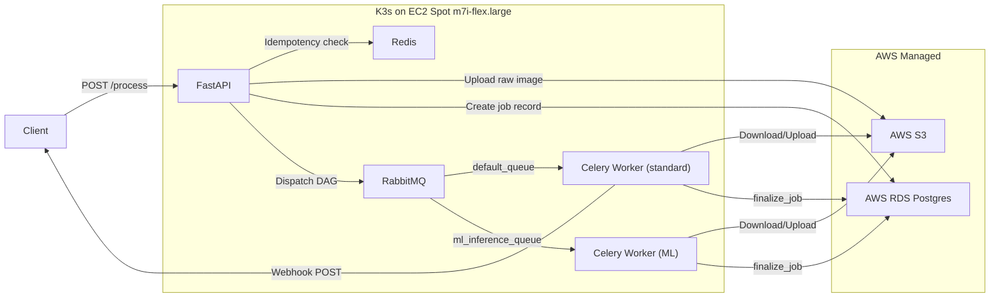
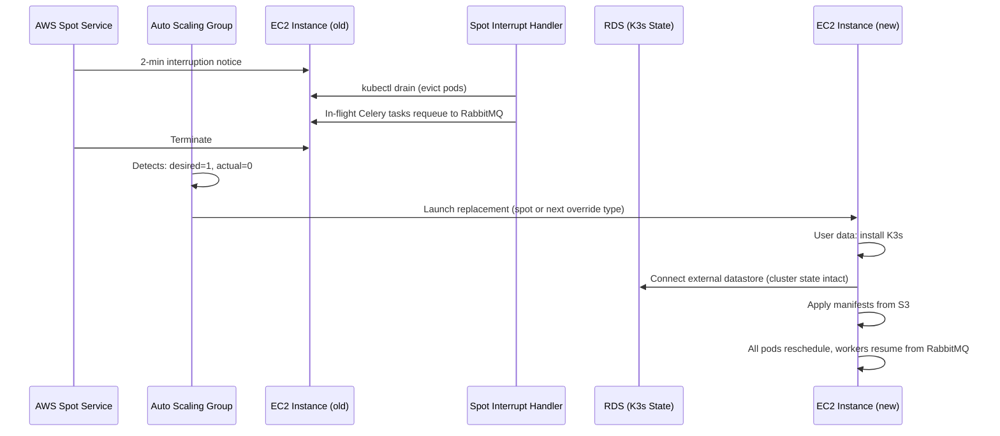

# PixTools — Hybrid-Cloud Distributed Task Queue

A resume-grade, production-ready image processing pipeline that decouples stateful components (Postgres, S3) into AWS managed services while keeping compute (K3s, Celery) self-hosted on AWS EC2 spot instances.

> [!TIP]
> **Interview Lens**: Every component below is chosen to demonstrate a specific distributed-systems concept. The "Why This Matters" callouts highlight the talking points that will differentiate you from candidates who just deploy tutorials.

---

## Architecture Overview



| Layer | Technology | Hosting |
|---|---|---|
| Control Plane | FastAPI (Python 3.12) | K3s pod |
| Message Broker | RabbitMQ 3.13 | K3s pod |
| Task Engine | Celery 5.4 (Canvas) | K3s pods |
| Object Storage | AWS S3 | Managed |
| State DB | AWS RDS PostgreSQL `t4g.micro` | Managed (app + K3s datastore) |
| Cache / Idempotency | Redis 7 | K3s pod |
| Autoscaling (pods) | KEDA 2.x | K3s operator |
| Autoscaling (node) | ASG `min=1, max=1` + mixed instances | AWS |
| Observability | Prometheus + Grafana + celery-exporter | K3s pods |
| Infrastructure | EC2 `m7i-flex.large` spot (ASG-managed) | AWS |

---

## Proposed Changes

### Project Scaffold

The entire project is greenfield. The directory structure will be:

```
d:\Github\PixTools\
├── app/                          # Python application
│   ├── __init__.py
│   ├── main.py                   # FastAPI entrypoint
│   ├── config.py                 # Pydantic Settings (env vars)
│   ├── models.py                 # SQLAlchemy ORM models
│   ├── schemas.py                # Pydantic request/response schemas
│   ├── database.py               # DB session factory
│   ├── dependencies.py           # FastAPI dependency injection
│   ├── logging_config.py         # Structured JSON logging + correlation IDs
│   ├── middleware.py             # RequestID middleware
│   ├── routers/
│   │   ├── __init__.py
│   │   ├── jobs.py               # /process endpoint
│   │   └── health.py             # /health deep health-check endpoint
│   ├── ml/
│   │   ├── __init__.py
│   │   └── dncnn.py              # DnCNN model definition (20-layer CDnCNN-B)
│   ├── services/
│   │   ├── __init__.py
│   │   ├── s3.py                 # boto3 S3 upload/download helpers
│   │   ├── idempotency.py        # Redis idempotency check/set
│   │   ├── dag_builder.py        # Celery Canvas DAG composer
│   │   └── webhook.py            # Circuit-breaker-wrapped webhook delivery
│   └── tasks/
│       ├── __init__.py
│       ├── celery_app.py         # Celery app config + queue routing + DLQ
│       ├── image_ops.py          # resize, webp, avif tasks
│       ├── ml_ops.py             # denoise (DnCNN inference) task
│       └── finalize.py           # finalize_job chord callback
├── models/                       # Pretrained weights
│   └── dncnn_color_blind.pth     # CDnCNN-B color blind denoiser
├── alembic/                      # DB migration management
│   ├── env.py
│   ├── alembic.ini
│   └── versions/
│       └── 001_initial_schema.py
├── tests/
│   ├── __init__.py
│   ├── conftest.py
│   ├── test_api.py
│   ├── test_dag_builder.py
│   ├── test_tasks.py
│   └── test_idempotency.py
├── k8s/                          # Kubernetes / K3s manifests
│   ├── namespace.yaml
│   ├── rabbitmq/
│   │   ├── deployment.yaml
│   │   └── service.yaml
│   ├── redis/
│   │   ├── deployment.yaml
│   │   └── service.yaml
│   ├── workers/
│   │   ├── worker-standard.yaml  # Deployment for default_queue
│   │   └── worker-ml.yaml        # Deployment for ml_inference_queue
│   ├── api/
│   │   ├── deployment.yaml
│   │   └── service.yaml
│   ├── keda/
│   │   └── scaledobject.yaml     # KEDA ScaledObject for RabbitMQ
│   └── monitoring/
│       ├── prometheus-config.yaml
│       ├── prometheus.yaml
│       ├── grafana.yaml
│       └── celery-exporter.yaml
├── infra/                        # Terraform IaC
│   ├── main.tf                   # Provider, VPC, subnets
│   ├── asg.tf                    # ASG + launch template (spot auto-recovery)
│   ├── rds.tf                    # RDS PostgreSQL t4g.micro (app + K3s state)
│   ├── s3.tf                     # S3 bucket + IAM policies
│   ├── sns.tf                    # SNS topic for spot interruption alerts
│   ├── security_groups.tf        # SG rules
│   ├── outputs.tf
│   └── variables.tf
├── .github/
│   └── workflows/
│       └── ci.yaml               # GitHub Actions CI pipeline
├── Dockerfile                    # Multi-stage build for app
├── docker-compose.yaml           # Local dev stack
├── requirements.txt
├── pyproject.toml
├── .env.example
└── README.md
```

---

### Python Application (`app/`)

#### [NEW] [config.py](file:///d:/Github/PixTools/app/config.py)
Pydantic `BaseSettings` loading from env vars:
- `AWS_S3_BUCKET`, `AWS_REGION`, `AWS_ACCESS_KEY_ID`, `AWS_SECRET_ACCESS_KEY`
- `DATABASE_URL` (RDS connection string)
- `REDIS_URL` (in-cluster Redis)
- `RABBITMQ_URL` (in-cluster RabbitMQ)
- `IDEMPOTENCY_TTL_SECONDS` (default 86400)
- `WEBHOOK_CB_FAIL_THRESHOLD` (circuit breaker failure threshold, default 5)
- `WEBHOOK_CB_RESET_TIMEOUT` (circuit breaker reset timeout, default 60s)

#### [NEW] [main.py](file:///d:/Github/PixTools/app/main.py)
FastAPI app factory with lifespan context manager for DB engine init. Registers `RequestIDMiddleware` and includes routers.

#### [NEW] [logging_config.py](file:///d:/Github/PixTools/app/logging_config.py)
Structured JSON logging via `python-json-logger`. Every log line includes `timestamp`, `level`, `message`, `request_id` (correlation ID), and `job_id` when available. Celery tasks propagate the `request_id` through task headers.

> [!TIP]
> **Why This Matters (Interview)**: "We use structured logging with correlation IDs so we can trace a single request from the API → RabbitMQ → worker → S3 → webhook. In prod, these feed into CloudWatch / ELK. This is how you debug distributed systems — not `print()` statements."

#### [NEW] [middleware.py](file:///d:/Github/PixTools/app/middleware.py)
`RequestIDMiddleware` — injects a UUID `X-Request-ID` into every request/response cycle and stores it in a `contextvars.ContextVar` for downstream logging.

#### [NEW] [models.py](file:///d:/Github/PixTools/app/models.py)
SQLAlchemy ORM `Job` model: `id` (UUID PK), `status` (enum: PENDING, PROCESSING, COMPLETED, FAILED), `operations` (JSON array), `result_urls` (JSON), `webhook_url`, `error_message` (nullable), `retry_count` (int), `created_at`, `updated_at`.

#### [NEW] [schemas.py](file:///d:/Github/PixTools/app/schemas.py)
Pydantic models:
- `JobCreate` — receives `operations: list[str]`, `webhook_url: HttpUrl`
- `JobResponse` — returns `job_id`, `status`, `created_at`
- `WebhookPayload` — `job_id`, `status`, `result_urls: list[str]`, `error_message: Optional[str]`
- `HealthResponse` — `status`, `dependencies: dict[str, str]`

#### [NEW] [database.py](file:///d:/Github/PixTools/app/database.py)
`create_async_engine` + `async_sessionmaker` using `asyncpg`. Provides `get_db` async generator for FastAPI `Depends`.

#### [NEW] [routers/jobs.py](file:///d:/Github/PixTools/app/routers/jobs.py)
`POST /process`:
1. Extract `Idempotency-Key` from headers
2. Check Redis via `idempotency.check(key)` → return cached `job_id` if hit
3. Stream `UploadFile` to S3 via `s3.upload_raw(file, key)`
4. Create `Job` record in RDS (status=PENDING)
5. Build Celery DAG via `dag_builder.build(job_id, operations, s3_key)`
6. Cache idempotency key in Redis with TTL
7. Return `202 Accepted` with `job_id`

`GET /jobs/{job_id}` — poll job status from RDS.

#### [NEW] [routers/health.py](file:///d:/Github/PixTools/app/routers/health.py)
`GET /health` — deep health check that probes every dependency:
```python
{
  "status": "healthy",
  "dependencies": {
    "postgres": "ok",       # SELECT 1
    "redis": "ok",          # PING
    "rabbitmq": "ok",       # connection check
    "s3": "ok"              # HeadBucket
  }
}
```
Returns `503` if any dependency is down. K8s readiness probe points here.

> [!TIP]
> **Why This Matters (Interview)**: "The health endpoint isn't just `/health → 200`. It probes Postgres, Redis, RabbitMQ, and S3. If any dependency is down, K8s marks the pod as NotReady and stops routing traffic. This prevents cascading failures."

#### [NEW] [services/s3.py](file:///d:/Github/PixTools/app/services/s3.py)
- `upload_raw(file, key)` — streamed upload to `s3://{bucket}/raw-images/{key}`
- `download_raw(key)` → `bytes` — download for Celery workers
- `upload_processed(data, key)` → `str` — upload to `/processed-images/`, return presigned URL

#### [NEW] [services/idempotency.py](file:///d:/Github/PixTools/app/services/idempotency.py)
- `check(key) -> Optional[str]` — `GET` from Redis, return job_id or None
- `set(key, job_id, ttl)` — `SETEX` into Redis

#### [NEW] [services/dag_builder.py](file:///d:/Github/PixTools/app/services/dag_builder.py)
Maps operation strings to Celery signatures. Logic:
```python
if len(ops) == 1:
    chain(single_task.s(job_id, s3_key), finalize_job.s(job_id))
else:
    chord(group(task.s(job_id, s3_key) for task in tasks), finalize_job.s(job_id))
```

#### [NEW] [services/webhook.py](file:///d:/Github/PixTools/app/services/webhook.py)
Webhook delivery with **circuit breaker pattern** (using `pybreaker`):
- **CLOSED** → normal delivery via `httpx.post()`
- **OPEN** (after N consecutive failures to the same domain) → skip delivery, mark job as `WEBHOOK_FAILED`
- **HALF-OPEN** → retry one request to test recovery

> [!TIP]
> **Why This Matters (Interview)**: "If a client's webhook endpoint goes down, we don't want to burn Celery worker time retrying indefinitely. The circuit breaker trips after 5 failures, stops attempting for 60s, then cautiously retries. This isolates a single bad downstream from degrading the whole system."

---

### Celery Tasks (`app/tasks/`)

#### [NEW] [celery_app.py](file:///d:/Github/PixTools/app/tasks/celery_app.py)
- Celery app with RabbitMQ broker, Redis result backend
- Queue routing table:
  ```python
  task_routes = {
      'app.tasks.ml_ops.denoise': {'queue': 'ml_inference_queue'},
      'app.tasks.image_ops.*':    {'queue': 'default_queue'},
      'app.tasks.finalize.*':     {'queue': 'default_queue'},
  }
  ```
- `task_acks_late = True`, `task_reject_on_worker_lost = True` (crash-resilience for spot instances)
- `worker_prefetch_multiplier = 1`
- **Dead Letter Queue** configuration:
  ```python
  task_queues = [
      Queue('default_queue', exchange=Exchange('default'), routing_key='default',
            queue_arguments={'x-dead-letter-exchange': 'dlx',
                             'x-dead-letter-routing-key': 'dead_letter'}),
      Queue('dead_letter', exchange=Exchange('dlx'), routing_key='dead_letter'),
  ]
  ```
  Tasks that exceed `max_retries` land in the DLQ for manual inspection instead of being silently dropped.

> [!TIP]
> **Why This Matters (Interview)**: "A DLQ means no message is ever silently lost. If an image has a corrupted header that crashes Pillow every time, after 3 retries it lands in the dead letter queue. We can inspect it, fix the bug, and replay the message. This is how production message queues work at scale."

#### [NEW] [image_ops.py](file:///d:/Github/PixTools/app/tasks/image_ops.py)
Tasks: `resize`, `convert_webp`, `convert_avif`
Each task: download from S3 → transform with Pillow → upload to S3 → return S3 URL. Every task logs `job_id` + `request_id` (correlation) on start/finish.

#### [NEW] [ml_ops.py](file:///d:/Github/PixTools/app/tasks/ml_ops.py)
Task: `denoise` — downloads image, runs DnCNN inference, uploads denoised result. Bound to `ml_inference_queue`.

**Model**: `dncnn_color_blind.pth` (CDnCNN-B variant)
- 20-layer fully convolutional network, 64 channels, 3-channel RGB I/O
- Residual learning: predicts noise residual, subtracts from input
- Blind Gaussian denoising (unknown noise level σ ∈ [0, 55])

**Model definition** (`app/ml/dncnn.py`):
```python
class DnCNN(nn.Module):
    def __init__(self, channels=3, num_layers=20, features=64):
        super().__init__()
        layers = [nn.Conv2d(channels, features, 3, padding=1), nn.ReLU(inplace=True)]
        for _ in range(num_layers - 2):
            layers.extend([nn.Conv2d(features, features, 3, padding=1),
                           nn.BatchNorm2d(features), nn.ReLU(inplace=True)])
        layers.append(nn.Conv2d(features, channels, 3, padding=1))
        self.dncnn = nn.Sequential(*layers)

    def forward(self, x):
        noise = self.dncnn(x)
        return x - noise  # residual learning
```

**Singleton loading** — model is loaded once at worker startup (not per-task) via Celery `worker_init` signal:
```python
_model = None

@worker_init.connect
def load_model(**kwargs):
    global _model
    _model = DnCNN()
    _model.load_state_dict(torch.load("models/dncnn_color_blind.pth", map_location="cpu"))
    _model.eval()
```

> [!TIP]
> **Why This Matters (Interview)**: "The model is ~2MB in memory but loading it from disk on every task would add 200ms+ latency. We use Celery's `worker_init` signal to load once at startup. The ML worker has `--concurrency=1`, so there's no race condition — one model instance, one task at a time, bounded memory."

#### [NEW] [finalize.py](file:///d:/Github/PixTools/app/tasks/finalize.py)
`finalize_job(result_urls, job_id)`:
1. Update RDS record → `status=COMPLETED`, store `result_urls`
2. Deliver webhook via `services/webhook.py` (circuit-breaker-wrapped)
3. If webhook delivery fails after retries, update status to `COMPLETED_WEBHOOK_FAILED` (data is still in S3, client can poll `GET /jobs/{id}`)

---

### Kubernetes Manifests (`k8s/`)

#### [NEW] [namespace.yaml](file:///d:/Github/PixTools/k8s/namespace.yaml)
Namespace: `pixtools`

#### [NEW] [rabbitmq/deployment.yaml](file:///d:/Github/PixTools/k8s/rabbitmq/deployment.yaml)
RabbitMQ 3.13 with management plugin. Resource limits: 512Mi RAM, 250m CPU. Liveness/readiness probes on port 5672.

#### [NEW] [redis/deployment.yaml](file:///d:/Github/PixTools/k8s/redis/deployment.yaml)
Redis 7 with `maxmemory 256mb` and `maxmemory-policy allkeys-lru`. Resource limits: 256Mi RAM, 100m CPU.

#### [NEW] [workers/worker-standard.yaml](file:///d:/Github/PixTools/k8s/workers/worker-standard.yaml)
- `replicas: 1` (KEDA manages scaling)
- Command: `celery -A app.tasks.celery_app worker -Q default_queue --concurrency=4`
- Resource limits: 512Mi RAM, 500m CPU

#### [NEW] [workers/worker-ml.yaml](file:///d:/Github/PixTools/k8s/workers/worker-ml.yaml)
- `replicas: 1` (fixed, **not** scaled by KEDA)
- Command: `celery -A app.tasks.celery_app worker -Q ml_inference_queue --concurrency=1`
- Resource limits: **2Gi RAM**, 1000m CPU (headroom for ML model)

#### [NEW] [api/deployment.yaml](file:///d:/Github/PixTools/k8s/api/deployment.yaml)
FastAPI served by Uvicorn, 2 replicas, resource limits 256Mi/250m. Exposes port 8000.

#### [NEW] [keda/scaledobject.yaml](file:///d:/Github/PixTools/k8s/keda/scaledobject.yaml)
```yaml
apiVersion: keda.sh/v1alpha1
kind: ScaledObject
metadata:
  name: celery-worker-standard-scaler
spec:
  scaleTargetRef:
    name: celery-worker-standard
  minReplicaCount: 0
  maxReplicaCount: 4
  triggers:
    - type: rabbitmq
      metadata:
        queueName: default_queue
        queueLength: "10"   # scale when depth > 10
        host: amqp://rabbitmq.pixtools.svc.cluster.local
```

#### [NEW] Monitoring manifests
- `prometheus-config.yaml` — scrape configs for celery-exporter, RabbitMQ metrics, node-exporter
- `prometheus.yaml` — Prometheus deployment
- `grafana.yaml` — Grafana deployment with provisioned datasource
- `celery-exporter.yaml` — Danihodovic/celery-exporter pointed at Redis result backend

---

### Terraform Infrastructure (`infra/`)

#### [NEW] [asg.tf](file:///d:/Github/PixTools/infra/asg.tf) *(replaces previous ec2.tf)*

This is the core of the automated spot recovery — an **Auto Scaling Group with `min=1, max=1, desired=1`** that self-heals when AWS reclaims the spot instance.

**Launch Template:**
- Instance type: `m7i-flex.large`
- `instance_market_options` → spot with `max_price` at on-demand ceiling
- IMDSv2 (required)
- IAM instance profile for S3 + RDS access
- **User data script** that bootstraps the entire node:

```bash
#!/bin/bash
set -euo pipefail

# 1. Install K3s with EXTERNAL DATASTORE (RDS) — cluster state persists across instances
curl -sfL https://get.k3s.io | sh -s - server \
  --datastore-endpoint="postgres://pixtools:${DB_PASSWORD}@${RDS_ENDPOINT}:5432/k3s_state" \
  --tls-san="${ELASTIC_IP}"

# 2. Wait for K3s to be ready
until kubectl get nodes; do sleep 2; done

# 3. Apply all workload manifests from S3
aws s3 sync s3://pixtools-manifests/k8s/ /var/lib/rancher/k3s/server/manifests/

# 4. Install spot interruption handler (systemd)
cat > /etc/systemd/system/spot-handler.service << 'EOF'
[Unit]
Description=EC2 Spot Interruption Handler
After=k3s.service

[Service]
Type=simple
ExecStart=/usr/local/bin/spot-interrupt-handler.sh
Restart=always
RestartSec=5

[Install]
WantedBy=multi-user.target
EOF
systemctl enable --now spot-handler
```

**Auto Scaling Group:**
```hcl
resource "aws_autoscaling_group" "k3s" {
  name                = "pixtools-k3s"
  min_size            = 1
  max_size            = 1
  desired_capacity    = 1
  vpc_zone_identifier = [aws_subnet.private.id]
  health_check_type   = "EC2"
  health_check_grace_period = 300

  mixed_instances_policy {
    instances_distribution {
      on_demand_base_capacity                  = 0
      on_demand_percentage_above_base_capacity = 0  # 100% spot
      spot_allocation_strategy                 = "capacity-optimized"
    }
    launch_template {
      launch_template_specification {
        launch_template_id = aws_launch_template.k3s.id
        version            = "$Latest"
      }
      # Fallback instance types (free-tier accessible)
      override {
        instance_type = "m7i-flex.large"
      }
      override {
        instance_type = "c7i-flex.large"
      }
      override {
        instance_type = "t3.small"
      }
    }
  }
}
```

**How the self-healing loop works:**



> [!TIP]
> **Why This Matters (Interview)**: "We don't use EKS — that's $72/month just for the control plane. Instead, K3s stores its cluster state in the same RDS instance we already have (separate database). When a spot instance is reclaimed, the ASG launches a replacement, K3s reconnects to the existing state in Postgres, and all manifests are re-applied from S3. The entire recovery is fully automated with zero manual intervention — it's the same self-healing behavior as EKS managed node groups but at zero additional cost."

> [!TIP]
> **Why `mixed_instances_policy` (Interview)**: "If `m7i-flex.large` spot capacity is exhausted in the AZ, AWS falls back to `c7i-flex.large` or `t3.small`. The `capacity-optimized` allocation strategy picks the pool with the lowest interruption probability. This means we almost never fall back to on-demand pricing."

**Spot interruption handler script** (`spot-interrupt-handler.sh`):
```bash
#!/bin/bash
# Polls EC2 metadata for 2-minute termination notice
while true; do
  RESPONSE=$(curl -s -o /dev/null -w "%{http_code}" \
    http://169.254.169.254/latest/meta-data/spot/instance-action)
  if [ "$RESPONSE" == "200" ]; then
    logger "Spot interruption notice received — draining node"
    kubectl drain $(hostname) --ignore-daemonsets --delete-emptydir-data --force
    sleep 120  # Let K3s/Celery finish graceful shutdown
  fi
  sleep 5
done
```

#### [NEW] [sns.tf](file:///d:/Github/PixTools/infra/sns.tf)
EventBridge rule + SNS topic for spot interruption notifications:
```hcl
resource "aws_cloudwatch_event_rule" "spot_interruption" {
  name        = "pixtools-spot-interruption"
  description = "Fires when EC2 spot instance gets interruption notice"
  event_pattern = jsonencode({
    source      = ["aws.ec2"]
    detail-type = ["EC2 Spot Instance Interruption Warning"]
  })
}

resource "aws_sns_topic" "spot_alerts" {
  name = "pixtools-spot-alerts"
}

# Subscribe your email/Slack webhook here
resource "aws_sns_topic_subscription" "email" {
  topic_arn = aws_sns_topic.spot_alerts.arn
  protocol  = "email"
  endpoint  = var.alert_email
}
```
This gives you visibility into how often interruptions happen — useful for tuning instance type selection.

#### [NEW] [rds.tf](file:///d:/Github/PixTools/infra/rds.tf)
- `db.t4g.micro`, 20GB gp3, PostgreSQL 16
- **Two databases**: `pixtools` (application data) + `k3s_state` (K3s external datastore)
- Private subnet, security group allowing port 5432 from EC2 SG only
- Automated backups, 7-day retention

#### [NEW] [s3.tf](file:///d:/Github/PixTools/infra/s3.tf)
- S3 bucket `pixtools-images-{account_id}` (processed images)
- S3 bucket `pixtools-manifests` (K3s manifest sync source)
- Lifecycle rule: move processed images to Glacier after 90 days
- IAM role for EC2 instance profile with `s3:PutObject`, `s3:GetObject`

#### [NEW] [security_groups.tf](file:///d:/Github/PixTools/infra/security_groups.tf)
- EC2 SG: ingress 6443 (K3s API), 22 (SSH), 80/443 (app)
- RDS SG: ingress 5432 from EC2 SG only

---

### Alembic Migrations (`alembic/`)

#### [NEW] [alembic/env.py](file:///d:/Github/PixTools/alembic/env.py)
Async migration runner using `asyncpg`. Reads `DATABASE_URL` from app config.

#### [NEW] [alembic/versions/001_initial_schema.py](file:///d:/Github/PixTools/alembic/versions/001_initial_schema.py)
Initial migration: creates `jobs` table with all columns.

> [!TIP]
> **Why This Matters (Interview)**: "We don't use `create_all()` in production. Alembic gives us versioned, reversible schema migrations. When we add a field later, the migration is tested in CI before it touches the RDS instance."

---

### Docker & Local Dev

#### [NEW] [Dockerfile](file:///d:/Github/PixTools/Dockerfile)
Multi-stage build:
1. `builder` stage: install dependencies into virtualenv
2. `runtime` stage: copy venv, set entrypoint (Uvicorn or Celery based on `CMD`)

#### [NEW] [docker-compose.yaml](file:///d:/Github/PixTools/docker-compose.yaml)
Local dev stack: FastAPI, RabbitMQ, Redis, PostgreSQL, Celery workers (standard + ML), LocalStack for S3 emulation.

#### [NEW] [.env.example](file:///d:/Github/PixTools/.env.example)
Template of all required environment variables.

---

### CI/CD Pipeline (`.github/workflows/`)

#### [NEW] [ci.yaml](file:///d:/Github/PixTools/.github/workflows/ci.yaml)
GitHub Actions pipeline triggered on push/PR to `main`:
1. **Lint** — `ruff check .`
2. **Type check** — `mypy app/`
3. **Unit tests** — `pytest tests/ -v --tb=short` (uses service containers for Postgres + Redis + RabbitMQ)
4. **Docker build** — `docker build -t pixtools:ci .` (validates the image builds)
5. **Terraform validate** — `cd infra && terraform init -backend=false && terraform validate`

> [!TIP]
> **Why This Matters (Interview)**: "Every PR runs lint + type checks + unit tests + Docker build + Terraform validate. Nothing merges unless all five pass. The CI uses GitHub service containers to spin up real Postgres/Redis/RabbitMQ — no mocking the infrastructure layer."

---

### Configuration Files

#### [NEW] [pyproject.toml](file:///d:/Github/PixTools/pyproject.toml)
Project metadata, dependencies (fastapi, uvicorn, celery, boto3, sqlalchemy, asyncpg, redis, httpx, pillow, pydantic-settings, python-json-logger, pybreaker, alembic), dev dependencies (pytest, pytest-asyncio, httpx, ruff, mypy).

#### [NEW] [requirements.txt](file:///d:/Github/PixTools/requirements.txt)
Pinned versions for reproducible builds.

---

## Improvements Summary (What Was Added)

These additions transform the project from "working demo" to "production-aware system design":

| Improvement | What It Demonstrates | Files |
|---|---|---|
| Structured JSON logging + correlation IDs | Distributed tracing fundamentals | `logging_config.py`, `middleware.py` |
| Dead Letter Queue (DLQ) | Message durability, poison-pill handling | `celery_app.py` |
| Circuit breaker on webhooks | Fault isolation, cascading failure prevention | `services/webhook.py` |
| Deep health checks | Operational readiness, K8s integration | `routers/health.py` |
| Alembic migrations | Schema versioning, production DB practices | `alembic/` |
| Spot interruption handler + ASG auto-recovery | Cloud-native self-healing without EKS | `asg.tf`, user data script |
| K3s external datastore on RDS | Cluster state survives node replacement | `asg.tf` (user data), `rds.tf` |
| Mixed instances policy | Spot capacity fallback, near-zero on-demand | `asg.tf` |
| SNS spot interruption alerts | Operational visibility | `sns.tf` |
| GitHub Actions CI | Automated quality gates | `.github/workflows/ci.yaml` |
| Error state tracking | Partial failure visibility | `models.py` (`error_message`, `retry_count`) |
| Type checking + linting | Code quality enforcement | `pyproject.toml` (ruff, mypy) |

---

## User Review Required

> [!IMPORTANT]
> **Spot Instance Auto-Recovery**: The plan uses an ASG `min=1/max=1` with `mixed_instances_policy` for automatic replacement. K3s uses `--datastore-endpoint` to store cluster state in RDS, so the replacement instance boots with the same cluster config. The ASG `capacity-optimized` strategy picks the spot pool with lowest interruption risk, falling back across `m7i-flex.large` → `c7i-flex.large` → `t3.small`. The 2-minute interruption handler drains the node and requeues tasks. Recovery time is ~3-5 minutes (new instance boot + K3s init). During that window, no requests are served.

> [!IMPORTANT]
> **ML Model Placeholder**: The `denoise` task will be implemented as a structural placeholder (download → stub transform → upload). The actual ML model loading can be swapped in later. Confirm this is fine for now.

> [!WARNING]
> **AWS Costs**: The `t4g.micro` RDS instance is free-tier eligible for 12 months. The `m7i-flex.large` spot instance is ~$0.03/hr (varies). S3 costs are negligible for dev. Ensure you have billing alerts configured.

---

## Verification Plan

### Automated Tests

1. **Unit tests** — run with `pytest tests/ -v`:
   - `test_dag_builder.py` — verifies single-op produces `chain`, multi-op produces `chord`
   - `test_tasks.py` — mocks S3 calls, verifies each task downloads/transforms/uploads correctly
   - `test_api.py` — uses `httpx.AsyncClient` with FastAPI `TestClient`, mocks Redis + DB + Celery `.delay()`

2. **Docker build validation**:
   ```bash
   docker build -t pixtools:test .
   ```

3. **K8s manifest validation**:
   ```bash
   # Using kubeval or kubectl dry-run
   kubectl apply --dry-run=client -f k8s/ -R
   ```

4. **Terraform validation**:
   ```bash
   cd infra && terraform init && terraform validate
   ```

### Manual Verification

1. **Local stack smoke test**: Run `docker-compose up -d`, then `curl -X POST http://localhost:8000/process` with a test image and `["webp"]` operation. Verify:
   - Job record appears in local Postgres
   - Image appears in LocalStack S3 `/processed-images/`
   - Webhook fires (use a local webhook.site or httpbin container)

2. **Idempotency test**: Send the same request with the same `Idempotency-Key` twice. Second request should return `200` with the same `job_id` immediately.

3. **DAG test**: Send a request with `["resize", "webp", "avif"]`. Verify all three processed images appear in S3 and the webhook payload contains all three URLs.
